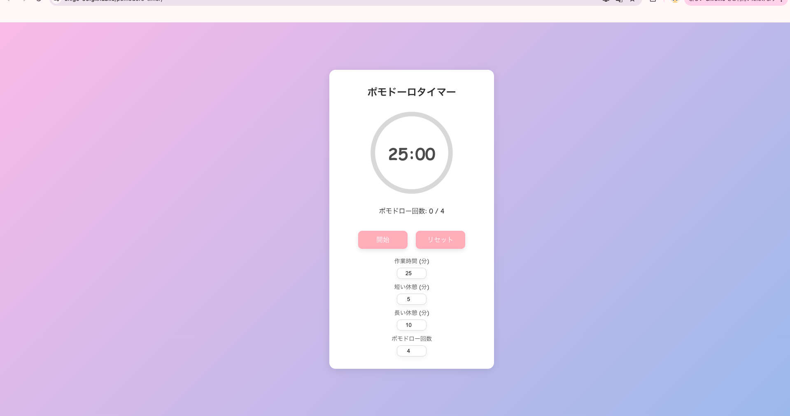
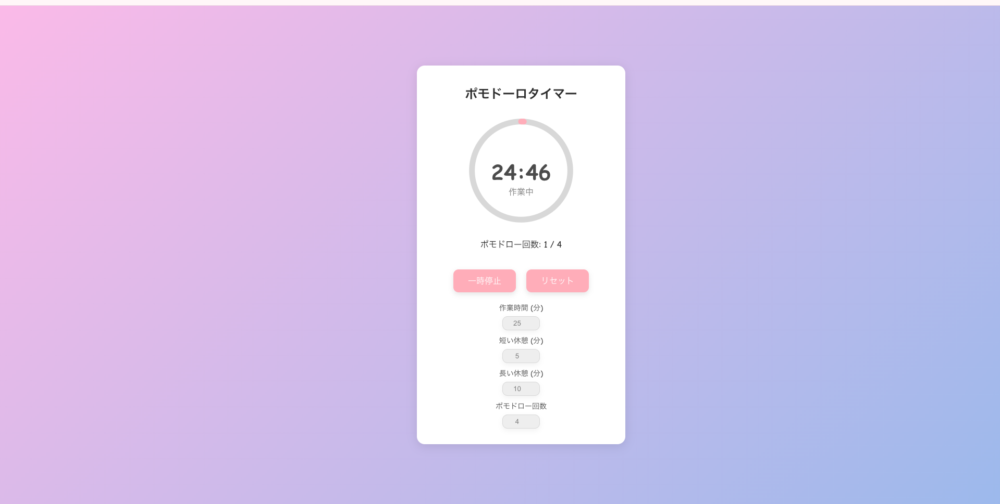

# ポモドーロタイマー ⏲️

作業時間と休憩時間を管理するためのシンプルなポモドーロタイマーです。  
作業フェーズ、短い休憩、長い休憩で**背景が自動的に切り替わる**のが特徴です。  
ユーザーが生産性を高め、効果的に時間を管理するために最適なツールです。

---

## 🚀 デモ
- [ポモドーロタイマー - GitHub Pages](https://username.github.io/pomodoro-timer)  

---

## 📸 スクリーンショット
**アプリの初期画面**  


**作業中の画面**  


---

## 🎨 機能
- 作業時間、短い休憩、長い休憩の**時間設定が可能**
- **背景グラデーション**がフェーズごとに切り替わり、視覚的なフィードバックを提供
- 作業終了、短い休憩終了、ポモドーロの完了時に**音声で**でお知らせ
- 作業完了後に**ポップアップ通知**で知らせる
- 一時停止、再開、リセット機能付き

---

## 🛠 使用技術
- **React.js**：ユーザーインターフェース構築
- **CSSアニメーション**：背景グラデーションの切り替え
- **JavaScript Hooks**：タイマーと状態管理

---

## 📦 インストールと実行方法
以下の手順でローカル環境にセットアップし、実行できます。

```bash
# リポジトリをクローン
git clone https://github.com/username/pomodoro-timer.git

# ディレクトリに移動
cd pomodoro-timer

# 必要なパッケージをインストール
npm install

# アプリを起動
npm start
